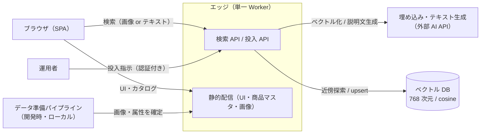

# i2i-search アーキテクチャ

商品 DB に対する「意味で探す」検索のデモ。クエリは画像でもテキストでもよく、どちらも同じ埋め込み空間に射影して近傍の商品を返す。

- 本番: https://i2i-search.cancer6.workers.dev
- リポジトリ: https://github.com/cancer/i2i-search

## 中心となる考え方

このシステムの核は「**商品を 1 本のベクトルとして単一の埋め込み空間に置く**」ことにある。

- 各商品は「商品画像 + 商品説明文」の複合埋め込み（768 次元）としてインデックスされる
- クエリ（画像 1 枚、またはテキスト）も同じモデルで同じ空間に射影される
- 検索は cosine 類似度による近傍探索であり、画像検索とテキスト検索は**同じ仕組みの入口違い**にすぎない
- 価格帯・サイズ・色などの構造化条件は、近傍探索の結果に重ねる後段フィルタとして扱う

類似度の比較可能性は「全ベクトルが同一モデル・同一次元で作られていること」だけに依存する。このため埋め込みの生成は投入側・検索側で単一のモジュールに集約し、モデルと次元をずらせない構造にしている。

## システム構成

| 要素 | 責務 | 実体 |
|---|---|---|
| ブラウザ（SPA） | 検索の入口（画像/テキスト/構造化条件）、結果表示、構造化条件の後段フィルタ | Svelte |
| エッジ | 検索 API・投入 API・静的配信を 1 つのデプロイ単位に同居 | Cloudflare Workers |
| ベクトル DB | 商品ベクトルとメタデータ（名前・カテゴリ・説明文・価格・サイズ・色）の保持と近傍探索 | Cloudflare Vectorize |
| 外部 AI | 埋め込み（画像・テキスト・複合）と商品説明文の生成 | Gemini API |
| データ準備パイプライン | 商品画像の収集と構造化属性（価格・サイズ・色）の確定。成果はリポジトリに固定 | ローカルスクリプト |

## データの持ち方

商品データは 2 箇所に分かれ、責務が異なる。

- **商品マスタ（静的アセット）**: カタログ表示に必要な確定情報 — 名前・カテゴリ・画像・価格・サイズ・色・画像のライセンス帰属。ビルド時に確定し、リポジトリで固定される
- **検索インデックス（ベクトル DB）**: 複合ベクトルと、検索結果の表示に必要なメタデータ。**商品説明文はここが唯一の置き場所**（生成物であり、投入のたびに作り直される）

「人が確定させるものはリポジトリに、機械が生成するものは DB に」という分担になっている。

## データフロー

### 準備（開発時）

商品画像を外部ソース（Wikimedia Commons）から収集して固定し、構造化属性を付与する。色属性は乱数ではなく**画像の支配色から導出**する — 検索条件の「色」が実際の見た目と一致することを、データ生成の段階で保証するため。

### 投入（運用時・エッジ上で実行）

認証付きの投入 API を分割呼び出しすると、エッジが商品ごとに「説明文を生成 → 画像+説明文を複合埋め込み → メタデータ込みで upsert」を行う。

- **エッジ上で実行する理由**: AI API の秘密鍵はエッジの secret として 1 箇所にだけ存在する。投入をエッジに寄せることで、鍵を他の場所へ複製せずに済む
- **分割呼び出しの理由**: エッジの 1 リクエストが発行できる外部呼び出し数に上限があるため、商品数をバッチに割る
- **upsert の理由**: 商品 ID を安定させ、再投入・画像差し替えを冪等にする

### 検索（実行時）

クエリをベクトル化 → 近傍探索（topK）→ メタデータ込みの結果を返す → ブラウザが構造化条件（価格帯・サイズ・色）で絞って表示する。

## アーキテクチャ上の決定と根拠

### 埋め込みプロバイダ: Gemini API（768 次元）

- 認証が API キー 1 つで済み、エッジからの直接呼び出しに OAuth 基盤が不要（Vertex AI は OAuth 必須 + 当該モデルの廃止予定があり不採用）
- 768 次元はベクトル DB 側の次元上限（1536）に収まる公式推奨値
- 画像・テキスト・複合入力を単一モデルで扱えるため、「入口違いの同一検索」という中心設計が成立する

### 単一 Worker への同居

API・静的配信・投入をひとつのデプロイ単位にまとめた。デモ規模では分割の運用コストが利得を上回る。静的配信とベクトル DB はどちらも同じエッジ基盤のマネージドサービスで、インフラの管理対象はこの Worker 1 つに閉じる。

### 構造化条件はクライアントサイドの後段フィルタ

商品数十件・数 KB の商品マスタは全件ブラウザに載っている。この規模で DB 側のフィルタリングを設計するのは過剰で、近傍探索の結果に述語 1 つを重ねれば足りる。商品数が増えたときの移行先はベクトル DB のメタデータフィルタ。

### 説明文は生成物として DB に置く

説明文は AI 生成であり、人が確定させるデータではない。リポジトリにコミットして固定するのではなく、投入パイプラインの一部として生成し検索インデックスに保存する。再投入すれば作り直される。

## 品質特性

- **秘密情報**: AI API キーと投入トークンはエッジの secret のみ。コード・レスポンス・リポジトリに現れない
- **書き込み境界**: DB へ書けるのは認証付き投入 API だけ。検索は読み取り専用
- **入力制限**: 画像はフォーマットとサイズを検証、テキストは長さを制限。上流 API のレート制限（無料枠想定）には逐次実行と再試行で適合
- **整合性**: 埋め込みモデル・次元の定義を一元化し、次元不一致は投入・検索の両方で即座に失敗させる（沈黙した空間のズレを作らない）
- **反映遅延**: ベクトル DB への upsert は非同期反映。投入直後の検索は部分的な結果になりうる（デモでは許容）

## 制約と限界

- 商品数はクライアントサイドフィルタと分割投入が成立する規模（数十〜数百件）を想定。桁が増えたら「構造化条件の DB 側適用」「投入のキュー化」が最初の変更点
- 近傍探索は topK で切ってからフィルタするため、厳しい条件では結果件数が topK を下回る
- 実写画像の品質は外部ソース依存で、類似度の絶対値はデータセットの均質さに左右される
