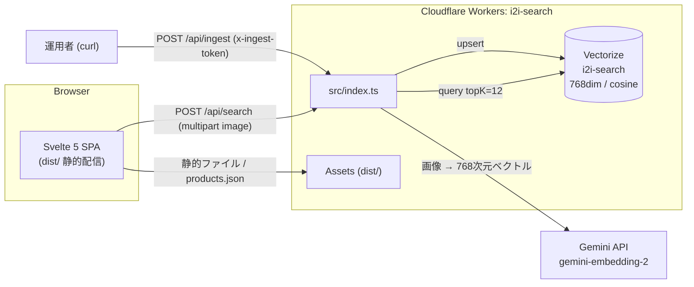

# i2i-search アーキテクチャ

商品 DB の「画像→類似画像検索」デモ。手元の画像 1 枚から、登録済み商品のうち見た目が近いものを返す。あわせて商品情報（キーワード・価格帯・サイズ展開・色）での検索も同じ UI から行える。

- 本番: https://i2i-search.cancer6.workers.dev
- リポジトリ: https://github.com/cancer/i2i-search

## 全体構成



検索は 2 系統あり、役割が異なる。

| 系統 | 入力 | 経路 | 対象 |
|---|---|---|---|
| 画像類似検索 | 画像（アップロード / D&D / カタログクリック） | Worker → Gemini → Vectorize | ベクトル空間上の近傍 |
| 商品情報検索 | キーワード + 価格帯 + サイズ + 色 | ブラウザ内で完結 | products.json のメタデータ |

メタデータ条件（価格・サイズ・色）は画像類似の結果にも適用される（例:「似ている椅子のうち 1 万円以下」）。

## コンポーネント

| パス | 責務 |
|---|---|
| `src/index.ts` | Worker。`POST /api/search`（類似検索）と `POST /api/ingest`（ベクトル投入）。それ以外は静的アセットへ委譲 |
| `src/embed.ts` | Gemini 埋め込みの唯一の呼び出し口。モデル名・次元・エンドポイントの定数を投入側と検索側で共有 |
| `src/ui/App.svelte` | UI 全体（検索パネル・結果グリッド・カタログ）。Svelte 5 runes |
| `scripts/generate-images.ts` | Wikimedia Commons から実写商品画像 48 枚（6 カテゴリ×8）を取得し 512×512 PNG 化、`public/products.json` を生成 |
| `scripts/enrich-products.ts` | products.json に price / sizes / color を付与。色は各商品画像の中央領域の支配色（sharp `stats().dominant`）を 8 色に分類 |
| `wrangler.jsonc` | Worker 定義。`assets.directory: "./dist"`、`run_worker_first: ["/api/*"]`、Vectorize binding（`remote: true`） |

## データフロー

### 1. データ準備（開発時・ローカル）

```
Commons API ──(generate:images)──▶ public/images/*.png + public/products.json
public/images ──(enrich:products)──▶ products.json に price/sizes/color を付与
```

生成結果はコミットして固定する。Commons の検索結果は時間で変わるため、再実行すると画像が入れ替わる。ライセンス帰属（作者・ライセンス・出典 URL）は products.json の `credit` に保持し、UI では画像の title 属性とフッターで表示する。

### 2. 投入（デプロイ後、運用者が実行）

```
curl -X POST /api/ingest?offset=0&limit=10 -H "x-ingest-token: <INGEST_TOKEN>"
（offset を 0,10,20,30,40 と変えて 5 回）
```

Worker が ASSETS から products.json と画像を読み、Gemini で埋め込みを計算して `VECTORIZE.upsert()` する。

- **分割式（limit≤10）**: Workers の 1 リクエストあたりサブリクエスト上限（無料プラン 50）に収めるため。1 呼び出し ≈ 商品 10 件 ×（画像取得 + Gemini + upsert）+ products.json 取得 ≈ 22
- **upsert**: id（`bag-01` 形式）固定なので再実行・画像差し替えが冪等
- **トークン認証**: 書き込み口を無防備にしないための最小限の保護

### 3. 検索（実行時）

1. ブラウザが multipart で画像を `POST /api/search`
2. Worker が Gemini `:embedContent` で 768 次元ベクトル化（8MB 超は 413、PNG/JPEG 以外は 400）
3. `VECTORIZE.query(values, {topK: 12, returnMetadata: "all"})`
4. `{id, score, name, category, image}` を返し、UI がメタデータ条件でさらに絞って表示

## 主要な設計判断と根拠

### 埋め込み: Gemini API `gemini-embedding-2`（768 次元）

- **Vertex AI `multimodalembedding@001` を不採用**: SDK アクセス廃止予定（2026-06）で、Workers から呼ぶには OAuth トークン生成が必要。Gemini API は API キー 1 つで済む
- **768 次元**: Vectorize V2 の上限が 1536 次元のため 3072 は不可。768 は公式推奨値の一つ
- **SDK 不使用・fetch 直叩き**: 依存を増やさず、Workers ランタイム互換の懸念を排除
- **応答形の両対応**: 公式資料間で `:embedContent` 応答が単数 `embedding.values` / 複数 `embeddings[0].values` と不整合だったため、両方を受理し、長さが 768 でなければ例外にする。実測では単数形が返る

### 埋め込みモジュールの一元化

投入と検索が別の実装でモデルや次元がずれると、類似度の比較可能性が壊れて順位が無意味になる。`src/embed.ts` に定数（モデル名・次元・エンドポイント）と呼び出しを集約し、両側がこれだけを使う。

### 投入のリモート化（`/api/ingest`）

当初はローカルスクリプト + `wrangler vectorize insert` だったが、Gemini API キーが Worker secret として設定済みである以上、ローカルにキーを再度渡すのは冗長。Worker 側に認証付きエンドポイントを置くことで、キーは Cloudflare の secret 1 箇所に閉じた。

### 商品情報検索はクライアントサイド

商品 48 件・数 KB の products.json はブラウザに全件ロード済み。この規模でサーバ側検索を作るのは過剰で、フィルタ（部分一致・価格帯・サイズ・色）は `$derived` の述語 1 つで足りる。商品数が増えたら Vectorize の metadata フィルタやテキスト埋め込みへの移行点になる。

### 色属性は画像から導出

色を乱数で割り当てると写真と食い違う。sharp で各画像の中央領域の支配色（`stats().dominant`）を取り、彩度 30 を閾値に無彩色（black/white/gray）と有彩色（brown/red/blue/green/beige）へ分けてから代表 RGB への最近傍で分類する。平均色ベースは彩度が打ち消されて灰色に偏った（gray 23/48）ため、この方式に改めた（改善後: black 10 / white 19 / gray 8 / brown 6 / beige 4 / green 1）。

## セキュリティと運用

- **secrets**: `GEMINI_API_KEY`（埋め込み）と `INGEST_TOKEN`（投入認証）。Worker secret のみで、コード・レスポンス・ログに出さない。ローカル開発は `.dev.vars`（gitignore 済み）
- **入力検証**: `/api/search` は PNG/JPEG のみ・8MB 上限。`/api/ingest` はトークン必須・limit 上限 10
- **Vectorize の反映遅延**: upsert は非同期反映で、投入直後の数分はクエリ結果が部分的になる。`wrangler vectorize info i2i-search` の vectorCount で確認できる
- **レート制限**: Gemini 無料枠を想定。埋め込みは逐次実行し、429 は指数バックオフで再試行
- **`wrangler dev`**: Vectorize にローカルシミュレーションが無いため binding は `remote: true`。開発でもネットワーク必須

## 検証

- `npm run typecheck` — Worker/scripts と UI（tsconfig 2 本）
- `npm test` — node:test。embed のリクエスト形（inline_data・outputDimensionality の位置）・次元不一致・非 2xx、Worker のルーティング・認証・入力検証、enrich の決定性
- `npm run build` — Vite/Svelte ビルド
- `.svelte` 内の型検査は依存追加（svelte-check）を避けて対象外。構文は Vite ビルドが検出する

## 既知の制約

- 実写画像は品質・構図が Commons 依存でばらつく。類似 score は 0.55〜0.65 帯に平坦化する（単色背景のイラストでは 0.85+ だった）
- 画像類似の結果はサーバで topK=12 に切られた後にメタデータ条件で絞るため、条件次第で表示件数が 12 未満になる
- `main` ブランチは空。実装はすべて `feat/image-search-demo` にある
